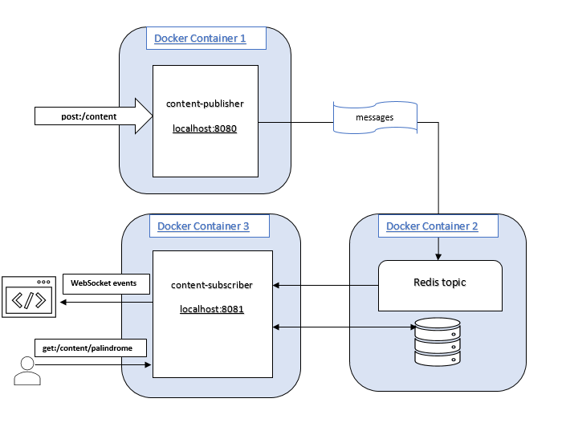

# Backend assignment - Data processor

This assignment solves the following use cases : 

-  REST endpoint accepting a JSON payload, and publishes it to a ```REDIS``` PubSub topic.

- PubSub topic consumer that persists the received JSON payload to ```REDIS``` database.

-  The received JSON payload is broadcasted to listening
browser clients via ```Websockets```.

-  REST endpoint that receives all messages from the database enriched with 
the ``longest_palindrome_size`` property.
 
-  A working ```docker-compose``` setup and configuration for running the solution.

-  The real time message delivery can be viewed in an ```html``` page.


## Design Diagram

A simplified representation of the proposed solution : 




## Installation
 
### Build

Your build setup should have java preinstalled.
Build is done with the Gradle wrapper as follows :

`./gradlew clean build`

### Deploy

The solution is designed to run in a ```docker-compose``` setup.
Use the following command to start the services : 

```docker-compose up --build```

### Result

After a successful start ,
-  A content-publisher service runs on port ```8080```.
-  A content-subscriber service runs on port ```8081```.
-  A Redis server runs on port ``6379``.

### APIs

- POST endpoint 

Creates a new content object and adds it to database.
```
curl
-d '{"content":"malayalam", "timestamp": "2018-10-09 00:12:12+0100"}' 
-H "Content-Type: application/json" 
-X POST http://localhost:8080/content

``````

- GET endpoint 

Returns the saved contents enriched with the ```longest_palindrome_size``` property,
``` 
curl http://localhost:8081/palindromes
[{"content":"malayalam","timestamp":"2018-10-08 23:12:12+0000","longest_palindrome_size":9}]
```

### Message Dashboard  
A dashboard to view the real time messages -> http://localhost:8081/index.html
- Note : User should click on  ```connect``` button to subscribe for real time events. 

### Swagger Documentation

Available at :

  http://localhost:8080/swagger-ui.html

  http://localhost:8081/swagger-ui.html

